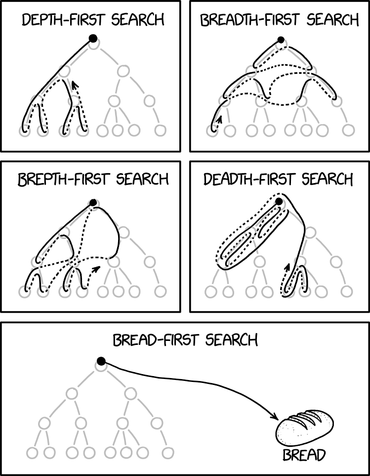

# Markdown Language Practice
## List in Markdown
### Unordered list:
To create a list, use the asterix or dash for unordered lists:

Asterix:
* Item 1
* Item 2

Dash:
- Item 1
- Item 2

### Ordered list:
For ordered lists, use the number followed by a period for each item in the list:

1. Item 1
2. Item 2

---
## Bold in Markdown
To **BOLD**, use double asterixes surrounding what you want to bold.

---
## Italic in Markdown
To *italicize*, use  asterixes surrounding what you want to italicize.

---
## Quotes in Markdown
For block quotes, surround the quote with greater than and less than signs.

> This is a block quote

## Code in Markdown
To include code, surround the quote by single back ticks.

`print("Hello World!")`

## Links in Markdown
To include [links](plaintext.txt) to other files, use brackets to surround the text wanted followed by parantheses surrounding the link.

[Link to main.py](main.py)

## Picture in Markdown
To include pictures, use an ! followed by brackets surrounding the text wanted and then parantheses surrounding the picture's url.

From [xkcd.com](https://www.google.com/url?sa=t&source=web&rct=j&url=https%3A%2F%2Fxkcd.com%2F2407%2F&ved=0CBYQjRxqFwoTCJCQpMu0rJIDFQAAAAAdAAAAABAH&opi=89978449)

---
## Table in Markdown
To include a table, use vertical bars to seperate columns and different lines to seperate rows. A row with brackets should be used to differentiate between headers and data.

| Column 1 | Column 2 |
| - | - |
| Data 1 | Data 2|
| Data 2 | Data 3|

---
Markdown Cheat Sheat Used: [Link](<https://www.markdownguide.org/cheat-sheet/>)